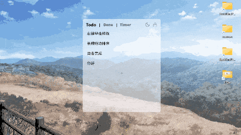
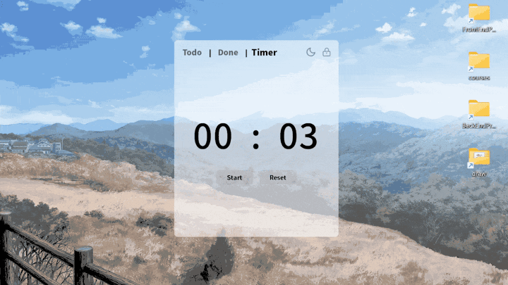
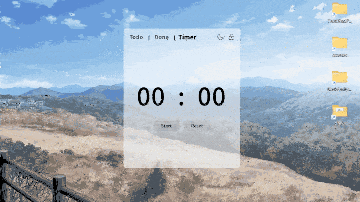

## Qt TodoList
一个Qt6编写的简易TodoList，包含倒计时和主题切换功能。

### 使用
#### Todo
- 点击新增按钮新增todo（esc取消，enter确认）
- 右键todo可修改内容（esc取消）
- 双击完成该todo
- 左键长按可拖动排序

#### Done
按完成时间排序已完成项，可恢复和删除。顶部按钮可以一键删除

#### Timer
倒计时，可点击数字修改时间。倒计时结束会出现弹窗提醒

#### 其他功能
##### 主题切换
点击按钮可以切换深色/浅色模式

##### 窗口锁定
点击窗口顶部拖动可以改变窗口位置。窗口四周可以改变窗口大小。点击按钮锁定之后窗口位置和大小不可以改变，窗口也会有鼠标穿透效果。再次点击按钮取消锁定

### 配置项
#### `config.json`

`borderRadius`: 窗口圆角大小

`theme`： 主题色
- `light`：亮色（默认）
- `dark`：暗色

`todoWrapMode`：换行方式
- `force`：超出长度强制换行（默认）
- `word`：按词换行（过长的词可能显示不全）

`windowHeight`: 窗口高度（默认600）

`windowWidth`: 窗口宽度（默认500）

`windowX`: 窗口x坐标

`windowY`: 窗口y坐标

`timerInitialSeconds`: Timer设置的时间

### 自定义构建
- `Qt6.5.3+`
- `C++17`
